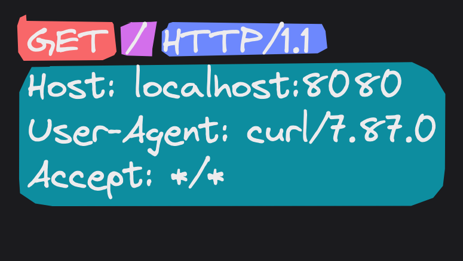

# Build a web server with Rust and tokio - Part 0: the simplest possible GET handler

Welcome to this series of blog posts where we will be exploring how to 
build a web server from scratch using the Rust programming language.
We will be taking a hands-on approach, maximizing our learning experience 
by using as few dependencies as possible and implementing as much logic as we can. 
This will enable us to understand the inner workings of a web server and the underlying 
protocols that it uses.

By the end of this tutorial, you will have a solid understanding of how to build a 
web server from scratch using Rust and the tokio library. So, let's dive in and 
get started on our journey!

In this first part, we'll be building a barebones web server that can only 
anwser GET requests with a static Not Found response. This will give us a
good starting point to build upon in the following tutorial.


## Setting up our project

First, we need to create a new Rust project. We'll use the following crates:
* [tokio](https://docs.rs/tokio/1.28.0/tokio/): async runtime 
* [anyhow](https://docs.rs/anyhow/1.0.44/anyhow/): easy error handling
* [maplit](https://docs.rs/maplit/1.0.2/maplit/): macro for creating HashMaps
* [tracing](https://docs.rs/tracing/0.1.27/tracing/): instrumentation
* [tracing-subscriber](https://docs.rs/tracing-subscriber/0.2.19/tracing_subscriber/): instrumentation
```bash
cargo new webserver
cargo add tokio --features full
cargo add anyhow maplit tracing tracing-subscriber
```

### Anatomy of a simple GET request
In order to actually see what a GET request looks like, we'll set up a simple server 
listening on port 8080 that will print the incoming requests to the console.
This can be done with `netcat`:
```bash
nc -l 8080
```
Now, if we open a new terminal and use `curl` send a simple GET request to 
our server, we should see the following output:



Let's break down the request parts:
* <span style="background-color: #F8676A">the method:</span>
    indicates the action to be performed on the resource. In this case, we are
    performing a GET request, which means we want to retrieve the resource.
* <span style="background-color: #D36FEB">the path:</span>
    uniquely identifies the resource. In this case, we are requesting
    the root path `/`. 
* <span style="background-color: #6D88FD">the protocol:</span>
    the protocol version. At this stage, we will always asume HTTP/1.1.
* <span style="background-color: #0F8D9F">the headers:</span>
    a set of key-value pairs that provide additional information about the request. 
    Our request contains the `Host` header, which indicates the host name of the server,
    the `User-Agent` header, which describes the client software that is making the request
    and the `Accept` header, which indicates the media types that are acceptable 
    for the response.

We'll use the following `struct` to represent requests in our code:
```rust
// req.rs

#[derive(Debug, Clone, Eq, PartialEq)]
pub struct Request {
    pub method: Method,
    pub path: String,
    pub headers: HashMap<String, String>,
}

#[derive(Debug, Copy, Clone, Eq, PartialEq, Hash)]
pub enum Method {
    Get,
}
```

